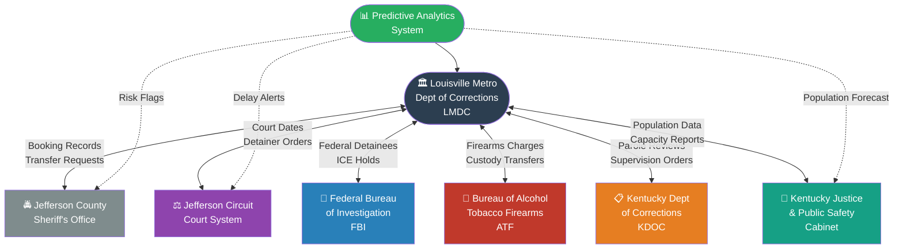

# Inter-Agency Coordination Flow

> **Data Flow:** Solid lines represent existing operational data exchanges. Dashed lines represent the **enhanced coordination** enabled by the predictive analytics system — automated alerts for court delays, risk notifications to partner agencies, and population forecasts shared with state oversight bodies.
