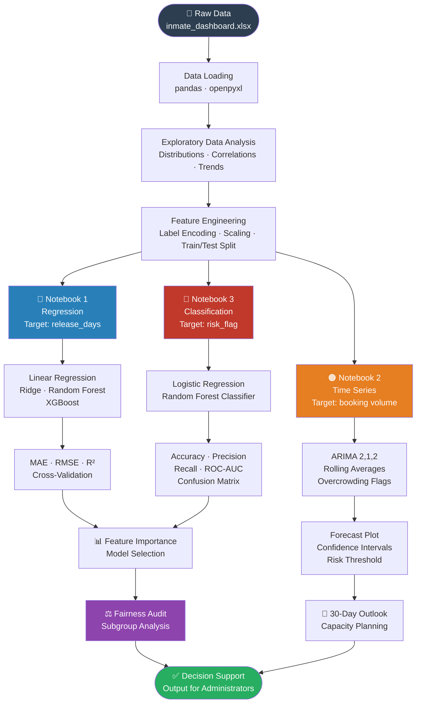

# Machine Learning Pipeline

> **Note:** All three notebooks feed into a unified decision-support layer. No model output is used as a standalone decision — all predictions are reviewed by corrections professionals.
