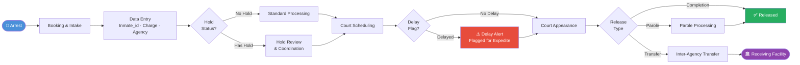

# Processing Pipeline

> **Key:** This pipeline maps the full inmate lifecycle from arrest to release. The Prediction Model (Notebook 1) activates at **Booking & Intake** to estimate release duration. The Risk Classifier (Notebook 3) activates immediately after **Data Entry** to flag high-risk cases. Population Forecasting (Notebook 2) aggregates all active cases to project facility load.
